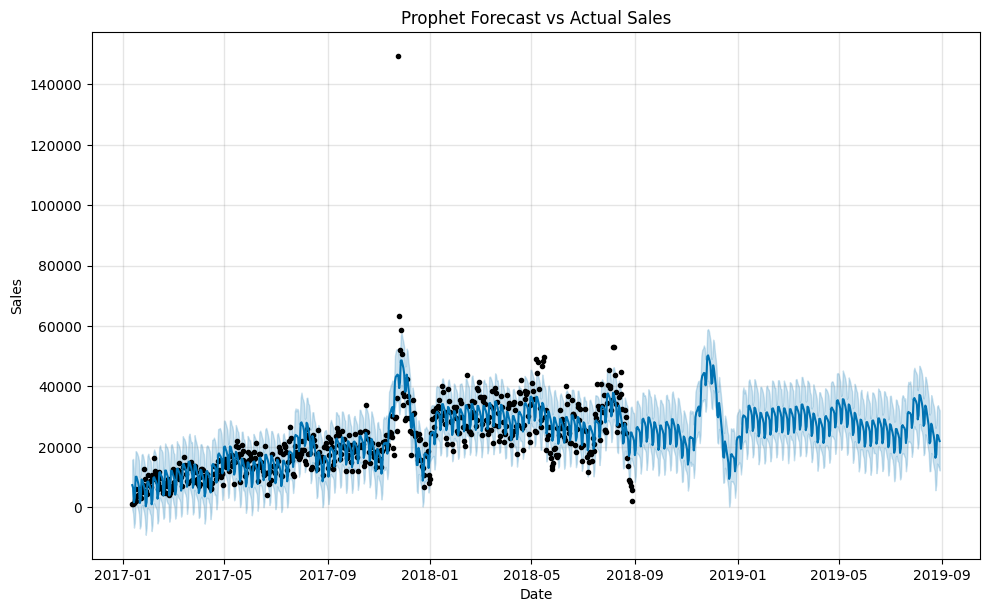

<div align="center">

# 🛒 Brazilian Olist E-Commerce Analytics & Forecasting

<p>
  
  
  
  
  
</p>

</div>

---

### 🎯 Problem Statement
In the competitive e-commerce landscape, understanding customer behavior, optimizing logistics, and forecasting sales are critical for growth. This project addresses key business challenges faced by the Brazilian e-commerce platform, Olist, by leveraging data science to unlock actionable insights from their historical data, ultimately aiming to enhance customer satisfaction and improve operational efficiency.

### 💡 Solution Overview
This project delivers a multi-faceted analytics solution that provides deep insights into the Olist e-commerce dataset. It combines advanced data analysis, machine learning, and interactive data visualization to create a comprehensive tool for business intelligence. The core of the project involves sentiment analysis of customer feedback, sales and revenue forecasting, customer/seller segmentation, and a root-cause analysis of delivery delays. The final insights are consolidated into a user-friendly Power BI dashboard and a predictive web application.

### ✨ Key Features & Methodologies
- **Sentiment Analysis:** Leverages NLP models (BERT, Hugging Face) to classify thousands of customer reviews, providing a real-time pulse on customer satisfaction and identifying areas for service improvement.
- **Time-Series Forecasting:** Forecasts future sales and order volumes using advanced models like Prophet, ARIMA/SARIMA, and XGBoost, enabling better inventory and resource management.
- **Customer & Product Segmentation:** Applies clustering algorithms to segment customers, sellers, and products based on purchasing behavior and characteristics, uncovering valuable patterns for targeted marketing strategies.
- **Delivery Delay Analysis:** Utilizes Spark SQL for large-scale analysis of logistics data to identify key bottlenecks and predict potential delivery delays, helping to optimize the supply chain.

---

### 🚀 Tech Stack
<p align="center">
  
  
  
  
  
  
  
  
  
  
  
  
</p>

---

### 📸 Snapshots

<div align="center">

**Power BI Dashboard**


**Sentiment Analysis Web App (Flask UI)**


**Clustering Result Visualization**


**Sales Forecast Plot**


</div>

---

### 🛠️ Setup and Usage
To run this project locally, follow these steps:

1.  **Clone the repository:**
    ```bash
    git clone [https://github.com/your-username/your-repo-name.git](https://github.com/your-username/your-repo-name.git)
    cd your-repo-name
    ```
2.  **Create a virtual environment and install dependencies:**
    ```bash
    python -m venv venv
    source venv/bin/activate  # On Windows, use `venv\Scripts\activate`
    pip install -r requirements.txt
    ```
3.  **Run the Flask application:**
    ```bash
    python app.py
    ```

---

### 📚 Dataset
The data used for this project is the **Brazilian E-Commerce Public Dataset by Olist**, sourced from Kaggle.
- **Source:** [Kaggle - Olist Dataset](https://www.kaggle.com/datasets/olistbr/brazilian-ecommerce)

---

### 🙏 Acknowledgements
This project was developed as part of the PG-DBDA program at C-DAC.
- **Project Team:** Team 007 members
- **Faculty Guide:** Sumit Bansod sir
- **Industry Mentor:** Prashant Bhosale sir


---

### 📬 Contact
Siddhant Sharma
- **Email:** paradox.sid07@gmail.com
- **LinkedIn:** https://www.linkedin.com/in/siddhant-a/
